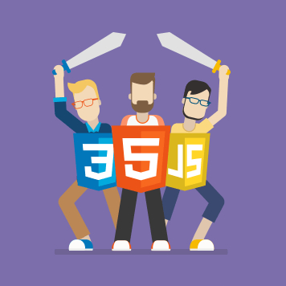

<!--
*** To avoid retyping too much info. Do a search and replace for the following:
*** loctran016, eleventy-kickstart-blog, twitter_handle, loctran016@icloud.com, Frontend Template, project_description
-->

<!-- PROJECT SHIELDS -->
<!--
*** I'm using markdown "reference style" links for readability.
*** Reference links are enclosed in brackets [ ] instead of parentheses ( ).
*** See the bottom of this document for the declaration of the reference variables
*** for contributors-url, forks-url, etc. This is an optional, concise syntax you may use.
*** https://www.markdownguide.org/basic-syntax/#reference-style-links
-->
<!-- markdownlint-disable MD041 MD033 MD030-->

[![Contributors][contributors-shield]][contributors-url]
[![Forks][forks-shield]][forks-url] [![Stargazers][stars-shield]][stars-url]
[![Issues][issues-shield]][issues-url]
[![MIT License][license-shield]][license-url]
[](http://standardjs.com)

<!-- PROJECT LOGO -->
<br />
<p align="center">
  <a href="https://github.com/loctran016/eleventy-kickstart-blog">
    
  </a>

  <h3 align="center">Frontend Template</h3>

  <p align="center">
    Frontend Template
    <br />
    <a href="https://github.com/loctran016/eleventy-kickstart-blog/issues">eleventy-kickstart-blogrt Bug</a>
    ·
    <a href="https://github.com/loctran016/eleventy-kickstart-blog/issues">Request Feature</a>
  </p>
</p>

<!-- TABLE OF CONTENTS -->
<details open="open">
  <summary><h2 style="display: inline-block">Table of Contents</h2></summary>
  <ol>
    <li>
      <a href="#about-the-project">About The Project</a>
      <ul>
        <li><a href="#built-with">Built With</a></li>
      </ul>
    </li>
    <li>
      <a href="#getting-started">Getting Started</a>
      <ul>
        <li><a href="#prerequisites">Prerequisites</a></li>
        <li><a href="#installation">Installation</a></li>
      </ul>
    </li>
    <li><a href="#usage">Usage</a></li>
    <li><a href="#roadmap">Roadmap</a></li>
    <li><a href="#contributing">Contributing</a></li>
    <li><a href="#license">License</a></li>
    <li><a href="#contact">Contact</a></li>
    <li><a href="#acknowledgements">Acknowledgements</a></li>
  </ol>
</details>

<!-- ABOUT THE PROJECT -->

## About The Project


<!-- GETTING STARTED -->

## Features

Production-ready in mind:

-   🔥 [11ty](https://www.11ty.dev) for Static Site Generator
-   🎨 Integrate with [Tailwind CSS](https://tailwindcss.com) (with
    [PurgeCSS](https://purgecss.com), remove unused CSS) and
    [DaisyUI](https://daisyui.com/)
-   💅 [PostCSS](https://postcss.org) for processing
    [Tailwind CSS](https://tailwindcss.com)
-   ⚡️ Lazy load images with [lazysizes](https://github.com/aFarkas/lazysizes)
-   ✨ Compress image with
    [Squoosh](https://github.com/GoogleChromeLabs/squoosh) (by running `yarn min`)
-   🎈 Syntax Highlighting with [Prism.js](https://prismjs.com)
-   ☕ Minify HTML & CSS with
    [HTMLMinifier](https://www.npmjs.com/package/html-minifier) and
    [cssnano](https://cssnano.co)
-   ✏️ Linter with [ESLint](https://eslint.org)
-   🛠 Code Formatter with [Prettier](https://prettier.io)
-   💨 Live reload
-   📦 Module Bundler with [Vite](https://vitejs.dev/)
-   🦊 Templating with [EJS](https://ejs.co) and
    [NJK](https://mozilla.github.io/nunjucks/templating.html)
-   🤖 SEO metadata and [Open Graph](https://ogp.me/) tags
-   ⚙️
    [JSON-LD](https://developers.google.com/search/docs/guides/intro-structured-data)
    for richer indexing
-   🗺 Sitemap.xml
-   ⚠️ 404 page
-   📖 Pagination
-   ✅ Cache busting
-   💯 Maximize lighthouse score
-   🌈 Include a FREE minimalist blog theme
-   ✨ Commit message with icon using [bump-version](https://github.com/PicGo/bump-version)
<!-- -   🗒 Netlify CMS (optional) -->

## Getting Started

To get a local copy up and running follow these simple steps.

### Prerequisites

This is an example of how to list things you need to use the software and how to
install them.

-   npm

    ```sh
    npm install yarn -g
    ```

### Installation

1. Clone the eleventy-kickstart-blog

    ```sh
    git clone https://github.com/loctran016/eleventy-kickstart-blog.git
    ```

2. Install NPM packages

    ```sh
    yarn install
    ```

<!-- USAGE EXAMPLES -->

## Usage

Use this space to show useful examples of how a project can be used. Additional
screenshots, code examples and demos work well in this space. You may also link
to more resources.

## Roadmap

See the
[open issues](https://github.com/loctran016/eleventy-kickstart-blog/issues) for a
list of proposed features (and known issues).

<!-- CONTRIBUTING -->

## Contributing

Contributions are what make the open source community such an amazing place to
be learn, inspire, and create. Any contributions you make are **greatly
appreciated**.

1. Fork the Project
2. Create your Feature Branch (`git checkout -b feature/AmazingFeature`)
3. Commit your Changes (`git commit -m 'Add some AmazingFeature'`)
4. Push to the Branch (`git push origin feature/AmazingFeature`)
5. Open a Pull Request

<!-- LICENSE -->

## License

Distributed under the MIT License. See `LICENSE` for more information.

<!-- CONTACT -->

## Contact

Loctran016 - [@loctran016](https://twitter.com/loctran016) - loctran016@icloud.com

Project Link:
[https://github.com/loctran016/eleventy-kickstart-blog](https://github.com/loctran016/eleventy-kickstart-blog)

<!-- ACKNOWLEDGEMENTS -->

## Acknowledgements

-   [Best Readme Template](https://github.com/othneildrew/Best-README-Template)
-   [Eleventy Starter Boilerplate](https://github.com/ixartz/Eleventy-Starter-Boilerplate)
    (some code here is come from this repo)
-   [eleventy-with-vite](https://github.com/fpapado/eleventy-with-vite) (thanks to this project, I can add vite)
     <!-- MARKDOWN LINKS & IMAGES -->
     <!-- https://www.markdownguide.org/basic-syntax/#reference-style-links -->

[contributors-shield]: https://img.shields.io/github/contributors/loctran016/eleventy-kickstart-blog.svg?style=for-the-badge
[contributors-url]: https://github.com/loctran016/eleventy-kickstart-blog/graphs/contributors
[forks-shield]: https://img.shields.io/github/forks/loctran016/eleventy-kickstart-blog.svg?style=for-the-badge
[forks-url]: https://github.com/loctran016/eleventy-kickstart-blog/network/members
[stars-shield]: https://img.shields.io/github/stars/loctran016/eleventy-kickstart-blog.svg?style=for-the-badge
[stars-url]: https://github.com/loctran016/eleventy-kickstart-blog/stargazers
[issues-shield]: https://img.shields.io/github/issues/loctran016/eleventy-kickstart-blog.svg?style=for-the-badge
[issues-url]: https://github.com/loctran016/eleventy-kickstart-blog/issues
[license-shield]: https://img.shields.io/github/license/loctran016/eleventy-kickstart-blog.svg?style=for-the-badge
[license-url]: https://github.com/loctran016/eleventy-kickstart-blog/blob/master/LICENSE.txt
